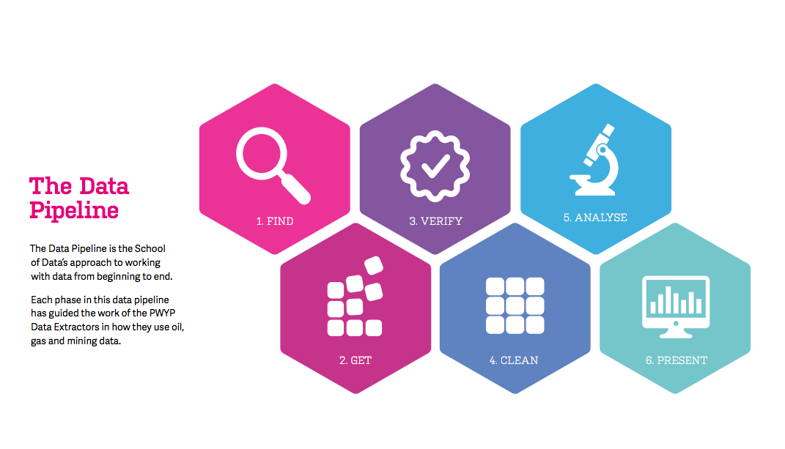

```{r setup, include=FALSE}
options(htmltools.dir.version = FALSE)
knitr::opts_chunk$set(cache = TRUE)
```

class:inverse, center, middle
background-image: url(./img/redaction.png)

# Faut-il coder pour être datajournaliste ?
## Comment les rédactions 
## peuvent utiliser R

</BR>
</BR>
</BR>

### Joël Gombin
### [datactivi.st/anglet](www.datactivi.st/anglet)

???

Image credit: [Musée Carnavalet](http://parismuseescollections.paris.fr/fr/musee-carnavalet/oeuvres/la-salle-de-redaction-du-journal-des-debats#infos-principales)


---
class: center, middle

[](https://creativecommons.org/licenses/by-sa/3.0/fr/)

---
class: inverse, center, middle


???

Je ne suis pas datajournaliste

---
class: center, middle


[](http://datactivi.st)

???

je ne suis qu'un datactivist

---
class: center, middle

[](https://marsactu.fr/author/joelgombin/)

---

class: middle 

- **What ?** Utiliser R, de manière plus ou moins intensive

- **Who ?** Des journalistes, mais aussi des datascientists, développeurs, ["graphics editor"](https://simplystatistics.org/2012/06/01/interview-with-amanda-cox-graphics-editor-at-the-new/), etc. 

- **Where ?** Dans les rédactions

- **When ?** Aujourd'hui :)

- **Why ?/ How ?** C'est la question que je veux explorer ici !


???

NYT : 4 équipes différentes de datajournalisme, avec chacune différents corps de métier spécialisés !

---
class: middle

[](https://www.rstudio.com/resources/videos/finding-and-telling-stories-with-r/)

???
De nombreuses rédactions utilisent ouvertement R et structurent leur utilisation

---
class: middle

[](https://github.com/fivethirtyeight/data)


---
class: center, middle

.reduite[[](https://fivethirtyeight.com/features/the-dallas-shooting-was-among-the-deadliest-for-police-in-u-s-history/)]

---
class: center, middle

.reduite[[](https://fivethirtyeight.com/features/the-dallas-shooting-was-among-the-deadliest-for-police-in-u-s-history/)]

---
class: center, middle

[](https://fivethirtyeight.com/features/the-dallas-shooting-was-among-the-deadliest-for-police-in-u-s-history/)

---
class: center, middle

[](https://github.com/fivethirtyeight/data/blob/33b01e4a37911fff33f1e8afa9bc01a8d3698d8b/police-deaths/clean.R)

---
class: center, middle

[](https://marsactu.fr/chroniques/chronique-data-boulanger-keeps-the-fn-away/)

.superreduite[[](https://marsactu.fr/chroniques/chronique-data-boulanger-keeps-the-fn-away/)]

---
class: center, middle

[](https://github.com/joelgombin/commerces)

---
class: center, middle

[](https://github.com/ft-interactive/R-tutorials)

---
class: center, middle


---
class: inverse, center, middle

# Reprenons par le début

---
class: center, middle

## Le pipeline de la data science d'après Hadley

[](http://r4ds.had.co.nz/)

---
class: center, middle

## Le pipeline de l'analyse de données d'après Open Knowledge

[](https://schoolofdata.org)

---
class: center, middle

# data journalism = data science ?

---
class: middle

> One of the ways we’re different from the data science people is that data journalists tend to only use a dataset once. We’re not dealing with a huge dataset over and over again. We tend to deal with data of modest size — maybe 20,000 or 100,000 records, not millions and millions. And we’re only looking for one thing about them. What we’re finding is that these techniques are really only time-efficient if you’re going to be repeating the same analysis over and over again, not a one-time thing.

[Sarah Cohen, NYT](https://journalistsresource.org/studies/society/news-media/research-chat-new-york-times-sarah-cohen-state-data-journalism-what-reporters-need-know)

---
class: middle, center

### Pourtant, le besoin de reproducibilité existe pour les journalistes...

---
class: inverse, center, middle

# Importer les données


---
class: middle, center

[.reduite[]](https://www.insee.fr/fr/statistiques/2409379?sommaire=2409559)


---
class: middle, center


---
class: middle, center

[](https://github.com/joelgombin/Insee2MonetDB)

---
class: inverse, middle, center

# Nettoyer

---
class: middle, center

[](https://www.nytimes.com/2014/08/18/technology/for-big-data-scientists-hurdle-to-insights-is-janitor-work.html)

---
class: inverse, middle, center


### Et tu wash, et tu wash, et tu wash...

---
class: middle, center


### `tidyverse` to the rescue

---
class: inverse, middle, center

# Transformer

---
class: middle, center

[](https://www.data.gouv.fr/fr/datasets/election-presidentielle-des-23-avril-et-7-mai-2017-resultats-definitifs-du-1er-tour-1/)

---
class: middle, center


---
class: middle, center

[](https://github.com/joelgombin/liremininterieur)

???

À la place, j'ai fait un package

---
class: middle, center


---
class: inverse, middle, center

# Visualiser

---
class: middle, center

# R est bon pour la visualisation... non ?

---

class: middle
# Problèmes

- besoin d'interactivité pour la publication en ligne => javascript

- besoin d'éditer pour la publication papier (AKA Illustrator)

- surtout, besoin de pédagogie

---
class: middle, center

[](https://www.nytimes.com/interactive/2017/06/08/world/europe/british-general-election-results-analysis.html?mcubz=0)

---
class: middle, center

### Sans doute encore un peu de travail pour que R 
### soit totalement satisfaisant pour le datajournalisme

---
class: middle, center

> Internet aime les chatons et les cartes.
> Fais moi des cartes

Johan Hufnagel (Slate.fr)

---
class: middle, center

[](http://www.slate.fr/france/87669/cartes-europeennes-2014)

---
class: inverse, middle, center

# Modéliser

---
class: middle, center

## Le point fort de R

## Le point faible du datajournalisme ?

---
class: inverse, middle, center

# Communiquer

---
class: middle, center

[](http://rmarkdown.rstudio.com/)

???
Je n'ai pas connaissance de médias publiés en Rmd, mais pourquoi pas ?

---
class: middle, center

[](https://shiny.rstudio.com/)

---
class: middle, center

[](http://joelgombin.github.io/makingof)

---
class: inverse, middle, center

# Pourquoi ?

---
class: middle

- Séparation entre faits et analyse/commentaire

- Transparence des sources => confiance

- Renouvellement des formats et des modèles économiques

- leaks massifs, *big data*...

---
class: inverse, middle, center

# Et maintenant ?

---
class: middle

## Questions fondamentales

- la formation

- le coût

---
class: inverse, middle, center

# Merci !

<BR>
<BR>
<BR>

### [datactivi.st/anglet](http://datactivi.st/anglet)

<BR>
<BR>

Slides réalisées avec [xarigan](https://github.com/yihui/xaringan)

